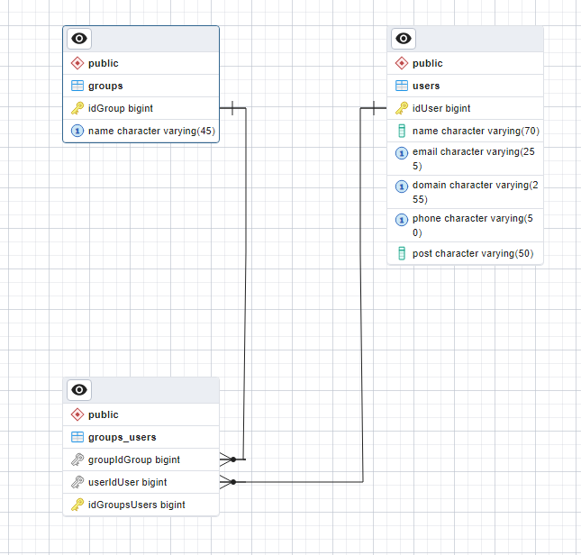

<h1>Серверная часть Kaspersky Project</h1>
<h3>Технологии:</h3>

<ul>
<li>Express.js</li>
<li>Sequelize</li>
<li>Typescript</li>
<li>JavaScript</li>
<li>PostgreSQL</li>
<li>Docker</li>
</ul>

<h3>Общие сведения:</h3>

В проекте определено две части:

<ul>
<li>Серверная часть приложения (./src)</li>
<li>Конфигурация базы данных (./sql)</li>
</ul>

<h5>База данных</h5>
База данных использует диалект PostgreSQL (хорошая документация, распространённая эко-система, опыт работы и т.д.). Все данные были сгенерированы с помощью двух вещей.
<ul>
<li>Скрипт ex.js, который генерировал подходящие под требования задания</li>
<li>Сайт Mockaroo. Генератор данных по параметрам (350 строк различных имён - его генерация по моему указанию)</li>
</ul>

Т.к. используется SQL нотация, то стоит определить 2 сущности: Users и Groups. Они имеют связи многие-ко-многим, а значит необходима вспомогательная таблица на физическом уровне реализации. Схема БД будет иметь следующий вид:

<h5>Серверная часть</h5>

Серверная часть приложения выполнена с использованием фреймворка Express.js. Взаимодействие с бд осуществляется посредством Sequelize. Т.к. в ТЗ требовалось обратить внимание на производительность запросов и фильтрации, то все запросы и фильтры реализованы посредством связки БД и Sequelize. Также было принято решение о реализации "тонкого клиента", т.е. все основные логические вычисления выполняются на серверной части.

<h3>Команды</h3>

Запуск серверной и бд частей: docker-compose.yml
